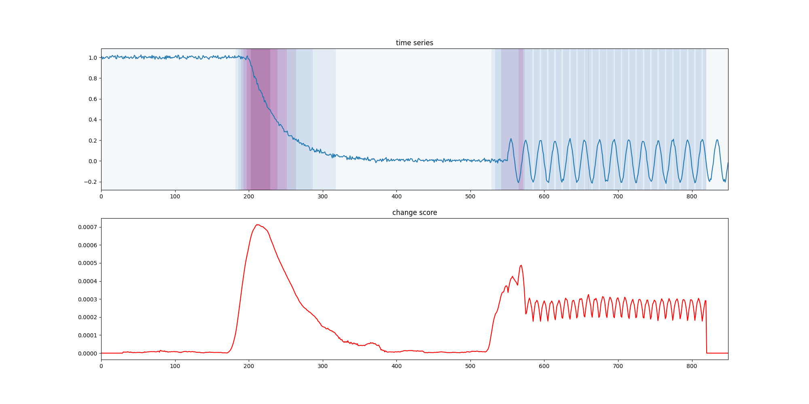
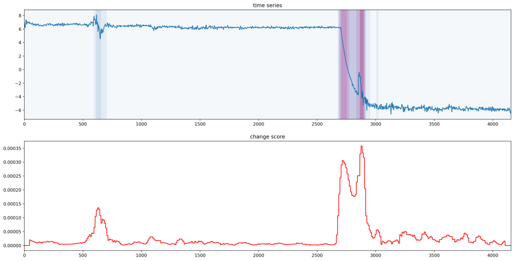
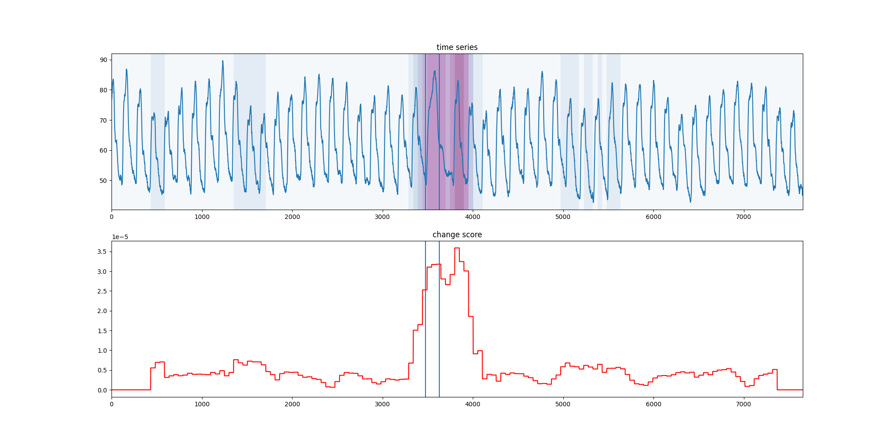

# Python Changepoint Detection (changepoynt)

 

This is the repository hosting the **pip-installable** python package changepoynt. It implements several 
change point detection techniques, while focusing mostly on "localized" algorithms, that could be run in an online 
fashion.

 

Current algorithms come from the field of:

* Statistics (Detection of Change in the statistical properties)

* Time Series Segmentation (Algorithms focused on comparing time series shape)

 

The package is aimed at execution performance (using JIT compilation and standing on the shoulders of giants like numpy 
and scipy) while also keeping code readable and maintainable. This includes comments as well as architectural choices. 
This might not be perfect, but we are trying!

 

All of our algorithms are implementations of a base changepoint detection interface and therefore are interchangeable. 
Currently, we are focused on shifting to the very common and existing sklearn interface of fit and transform. This 
enables our algorithms to be part of the standard sklearn pipeline for preprocessing.

# Quick Start
If you want to start using the package right away, we recommend to use one of the singular spectrum transformation
algorithms (SST). The first step is to install the package using pip. Then you can use the following example code:

```python
import numpy as np  # for signal creation
import matplotlib.pyplot as plt  # to show the plot
from changepoynt.algorithms.esst import ESST  # import the scoring algorithm
from changepoynt.visualization.score_plotting import plot_data_and_score  # import a visualization function

# create a signal that goes from steady to exponential decline into a sine curve
exp_signal = np.exp(-np.linspace(0, 5, 200))
steady_after = np.exp(-5)*np.ones(150)
steady_before = np.ones(200)
sine_after = 0.2*np.sin(np.linspace(0, 3*np.pi*10, 300))

# make the signal by concatenating the differen parts
signal = np.concatenate((steady_before, exp_signal, steady_after, sine_after))
signal += 0.01*np.random.randn(signal.shape[0])

# This part is all you need to do to score a signal with our package 
# create the scorer and compute the change score
detector = ESST(30)
detection = detector.transform(signal)

# make the plot                                                       
plot_data_and_score(signal, detection)
plt.show()

```

The result looks like this:


# Examples

You can find example code within the examples folder of this repository. We also wanted to tease the
functionality using two different signals in order to show the capabilities of one of our recommended algorithms
[ESST](./changepoynt/algorithms/esst.py). If you want to use the algorithms on the contents of a CSV
directly, there is a frontend demonstrator currently hosted [here](http://static.17.221.107.91.clients.your-server.de/) 
(please note that the connection is not ssl-encrypted, the code for the demonstrator is 
[here](https://github.com/Lucew/changepoynt/tree/master/frontend)).

The first application is a simulated temperature of a component in a power plant during shutdown.
We artificially added a disturbance at the end of the shutdown, to show the capability of the algorithm to
detect a change even in case of another major change.



The other application is for anomaly detection within periodic signals. The example is time series
34 from the
[Hexagon ML/UCR Time Series Anomaly Detection dataset](https://www.cs.ucr.edu/~eamonn/time_series_data_2018/), where we
set the window size for the ESST to three times the estimated period in samples (estimated using maximum of FFT).


 
Both plots have been created using `changepoynt.algorithms.esst` and the plot function from 
`changepoynt.visualization.score_plotting`.

# Installation

You can install `changepoynt` from the common package index [PyPi](https://pypi.org/project/changepoynt/) using the 
following line with pip:

 

    pip install changepoynt

 

Please be aware, that we are currently in an alpha development phase, as this is part of a research project at the FAU 
Erlangen together with SIEMENS Energy developed by [me](https://www.cs6.tf.fau.eu/person/lucas-weber/). Nevertheless, 
we aim to be open-source and try our best to guarantee that all the code we use has very permissive licenses.

# Participating

We always love to get feedback or new ideas. If you have any of those, feel free to open an issue. We try to get back to
you as soon as we can.

 

If you are an author of a paper in the field or have another algorithmic idea: Feel free to open a pull request. 
Currently, we are still working on the contribution guides. But if somebody already comes along and has an idea, we do 
not want to be in the way!

# Outlook

We are actively working on the package, and currently have the following steps planned:

- Implement Kliep/RulSif as statistical change point detections using direct density estimation
- We are actively working on a benchmark tool for change poing algorithms

If you have further ideas, do not hesitate to open a ticket or a pull request!