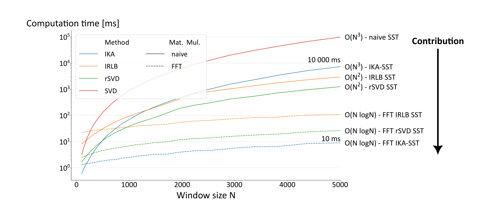

# Fast SST and IKA-SST
> TL;DR: For window sizes/lengths > 200 activate `fast_hankel=True` when using the 
> [SST](../changepoynt/algorithms/sst.py) (with `method='ika'` or `method='rsvd'`)
> 
Wie published a [paper](https://doi.org/10.1109/ACCESS.2025.3640386) on accelerating the SST and IKA-SST. The paper is
open access and available for everyone. There is [dedicated source code](https://github.com/Lucew/approximate_hankel)
for reproducing the paper, but we also implemented the methods in this package.

Depending on the application, our contributions reduce the runtime from minutes to (milli)seconds while they only incur 
a minor approximation error:

To use the methods activate `fast_hankel=True` and the option `method='ika'` or `method='rsvd'` when using the
[SST algorithm](../changepoynt/algorithms/sst.py).

In the paper, we reduce the complexity of both the SST and IKA-SST from O(N³) to O(N logN) with respect to the window
size N. After a window size of around 200 this results in faster runtimes. Starting from this point, the speedup
is only ever-increasing:
