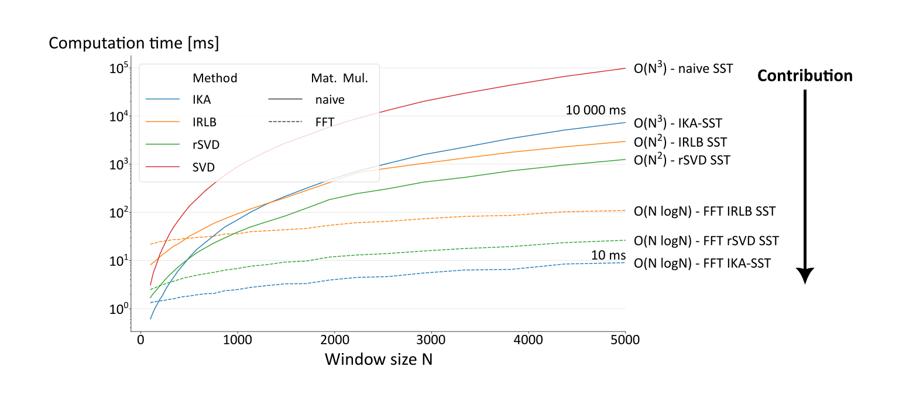
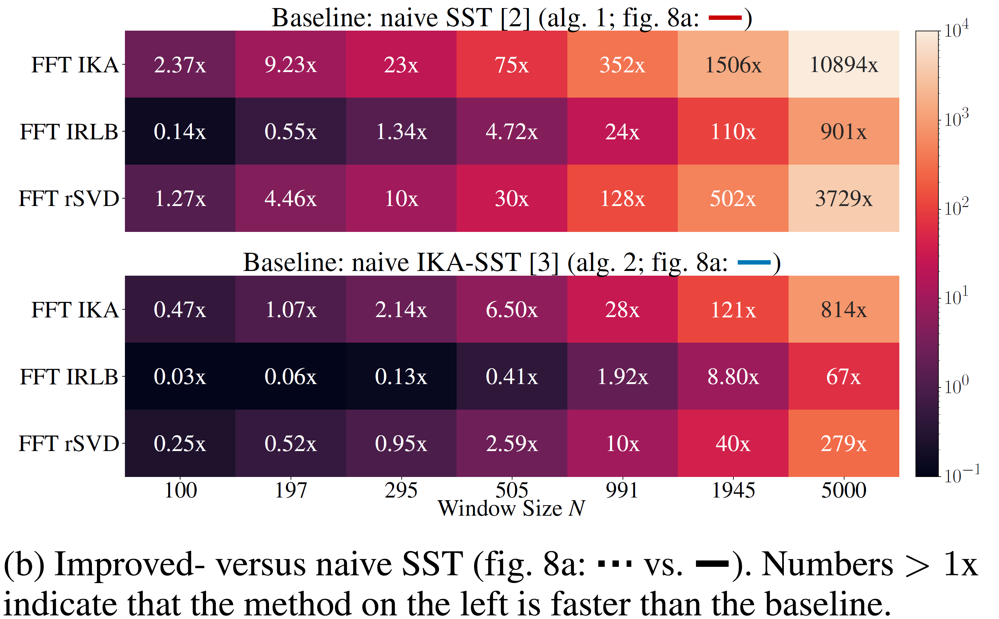

# Fast SST and IKA-SST

> TL;DR: For window sizes or lengths greater than 200, benchmark `use_fast_hankel=True` when using [SST](api/algorithms.md#changepoynt.algorithms.sst.SST) with `method="ika"`, or for window sizes greater than 300 with `method="rsvd"`.
>
> Additionally, consider increasing `scoring_step` to make larger steps through the signal. For example, `scoring_step=2` is roughly twice as fast.

We published a [paper](https://doi.org/10.1109/ACCESS.2025.3640386) on accelerating the SST and IKA-SST. The paper is open access. There is also [dedicated source code](https://github.com/Lucew/approximate_hankel) for reproducing the paper, but the methods are implemented in this package as well.

Depending on the application, our contributions reduce the runtime from minutes to milliseconds or seconds while they only incur a minor approximation error:

To use the methods, activate `use_fast_hankel=True` and set the option `method="ika"` or `method="rsvd"` when using the [SST algorithm](api/algorithms.md#changepoynt.algorithms.sst.SST).

In the paper, we reduce the complexity of both the SST and IKA-SST from O(N^3) to O(N log N) with respect to the window size N. After a window size of around 200, this results in faster runtimes. Starting from this point, the speedup is only ever-increasing:

