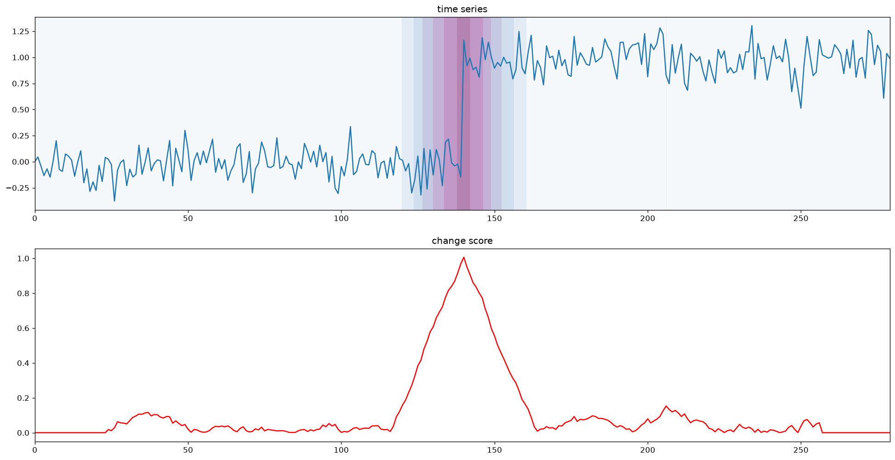

# Visualizing Change Scores

`plot_data_and_score` aligns a signal and its change score in one figure:

- The upper panel plots the signal. Its background becomes darker where the score is larger.
- The lower panel plots the score by itself on the same x-axis.



## Basic Use

```python
import matplotlib.pyplot as plt
import numpy as np

from changepoynt.algorithms.baseline import MovingWindow
from changepoynt.visualization.score_plotting import plot_data_and_score

rng = np.random.default_rng(7)
signal = np.r_[rng.normal(0.0, 0.15, 140),
               rng.normal(1.0, 0.15, 140)]

score = MovingWindow(window_length=24).transform(signal)
figure = plot_data_and_score(signal, score)
plt.show()
```

The background color uses `score / score.max()`. It therefore shows relative score strength within the plotted signal; it is not a probability or threshold.

## Parameters

`raw_data` : `numpy.ndarray`, shape `(n_samples,)` or `(n_samples, n_channels)`
: Signal plotted in the upper panel.

`score` : `numpy.ndarray`, shape `(n_samples,)`
: Score used for the background and lower panel. It should be aligned with `raw_data` and have the same number of samples.

**Returns**

`figure` : `matplotlib.figure.Figure`
: Matplotlib figure containing the signal and score axes.

## Saving the Figure

```python
figure = plot_data_and_score(signal, score)
figure.savefig("change-score.png", dpi=150, bbox_inches="tight")
```

## Multidimensional Signals

Two-dimensional input currently works when samples are on axis 0. Matplotlib draws one line for every channel on the shared upper axis:

```python
multivariate_signal = np.column_stack((temperature, pressure, vibration))
score = detector.transform(multivariate_signal)
figure = plot_data_and_score(multivariate_signal, score)
```

The helper does not add channel labels or separate axes, so many channels can become difficult to read. For larger multivariate signals, plot selected channels or build a custom subplot layout.

!!! note "Score alignment"
    The helper is designed for scores with one value per input sample. Algorithms such as FLUSS return a shorter matrix-profile score; pad or otherwise align that score before using this helper with the full signal.
