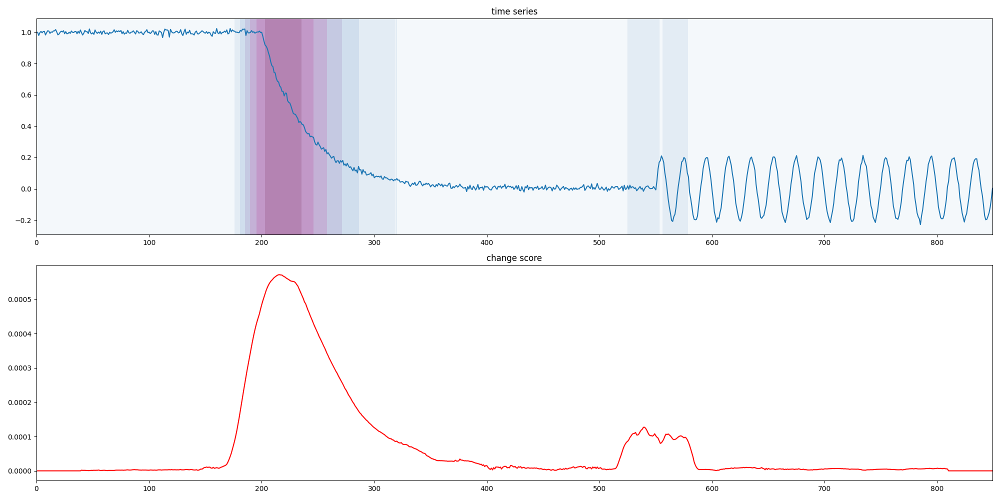
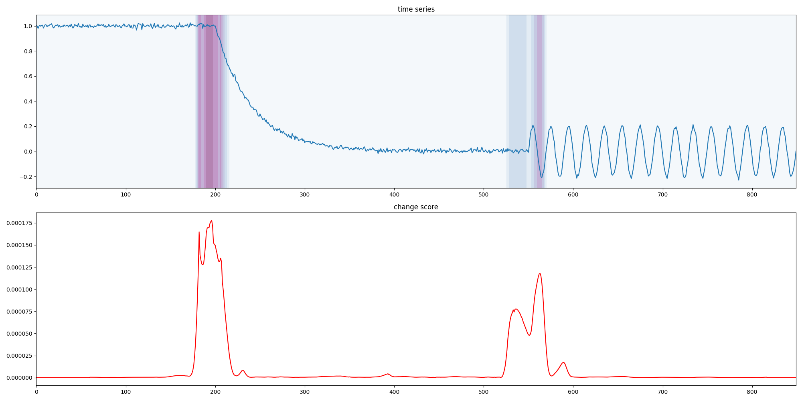

# Quickstart

The following example creates a synthetic time series, computes change point scores with ESST and SST, and plots the results.

```python
import numpy as np
import matplotlib.pyplot as plt

from changepoynt.algorithms.esst import ESST
from changepoynt.algorithms.sst import SST
from changepoynt.visualization.score_plotting import plot_data_and_score

# Create a signal that goes from steady to exponential decline into a sine curve.
exp_signal = np.exp(-np.linspace(0, 5, 200))
steady_after = np.exp(-5) * np.ones(150)
steady_before = np.ones(200)
sine_after = 0.2 * np.sin(np.linspace(0, 30 * np.pi, 300))

signal = np.concatenate((steady_before, exp_signal, steady_after, sine_after))
signal += 0.01 * np.random.randn(signal.shape[0])

esst_detector = ESST(40)
esst_detection = esst_detector.transform(signal)

sst_detector = SST(40, method="rsvd", mitigate_offset=True)
sst_detection = sst_detector.transform(signal)

plot_data_and_score(signal, esst_detection)
plt.gcf().tight_layout()

plot_data_and_score(signal, sst_detection)
plt.gcf().tight_layout()

plt.show()
```

The result should look similar to these examples:

**ESST**



**SST**


